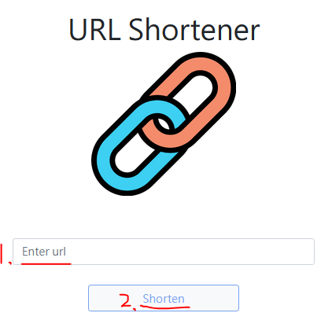
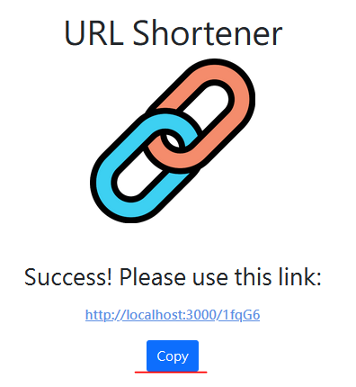

# alphacamp-url-shortener
短網址產生器

## 專案使用

### 安裝依賴套件

```
npm install
```

### 啟動伺服器

```
npm run dev
```

### 縮短網址

在 `1` 輸入要縮短的網址，按下 `2` 的按鈕，就可以獲得縮短的網址



### 複製短網址

按下 `Copy` 按鈕後會複製短網址到剪貼簿，並返回上一頁，以繼續縮短網址


